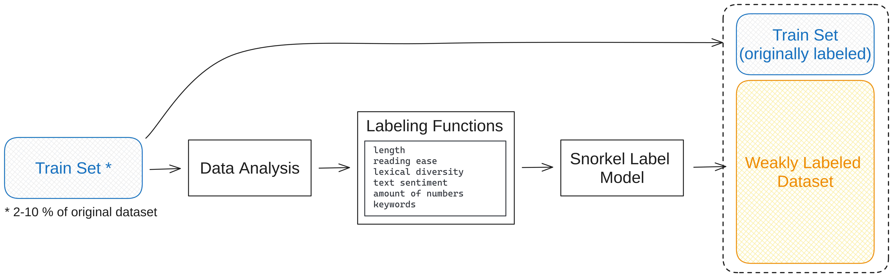

# Language Modeling with Reinforcement Learning from Human Feedback with Weak Supervision

This repository contains the code and data for the **Bachelor Thesis** titled **"Language Modeling with Reinforcement Learning from Human Feedback with Weak Supervision"**, written at TU Berlin and Deutsches Forschungszentrum für Künstliche Intelligenz (DFKI).

## Abstract

Recent advancements in large language models (LLM) have led to their increased application across various tasks. Reinforcement learning from human feedback (RLHF) has emerged as a key step in the training pipeline of LLMs, improving model performance and alignment with user intentions. In the RLHF process, human labelers or AI systems select a preferred response from a pair of responses to a prompt. This preference data is then used to train a reward model, which aims to emulate these preferences and then refine an LLM through reinforcement learning.

This thesis introduces weak supervision as a strategy to extend existing RLHF datasets, thereby enhancing reward model performance. Weak supervision provides an alternative to relying on manually labeled data by using noisy or imprecise labels, enabling the use of more, but less accurate training data. We analyze RLHF datasets to identify factors that correlate with response preference. These heuristics are combined using a label model capable of weakly annotating unlabeled data. Although the annotations from this label model are noisy and imprecise, they can decrease the need for costly hand-labeled data.

Our comprehensive evaluation demonstrates that weak supervision can significantly benefit smaller RLHF datasets, improving the performance of reward models. However, its effectiveness diminishes with larger originally labeled datasets. Moreover, using an LLM to generate responses that are subsequently weakly labeled proves to be a promising method for extending RLHF datasets.

### Pipeline Overview



This diagram illustrates the process used in this thesis to apply weak supervision to extend RLHF datasets:
1. **Train Set (2-10% of original dataset)**: The original labeled data used for calibration and data analysis.
2. **Data Analysis**: Analyzing the data to identify features like text length, reading ease, and sentiment for use in labeling functions.
3. **Labeling Functions**: Simple heuristics based on features that provide probabilistic labels through weak supervision.
4. **Snorkel Label Model**: Aggregates the output of labeling functions to assign labels to the remaining unlabeled data.
5. **Train Set (Originally Labeled) and Weakly Labeled Dataset**: Combines the baseline train set with weakly labeled data to improve model performance.

## Project Structure
- **Code**: Code pipeline for extending existing RLHF datasets.
- **Datasets**: Baseline and weakly labeled datasets.

For installation clone the repository:
   ```bash
   git clone https://github.com/DFKI-NLP/weak-supervision-rlhf.git
